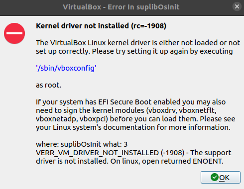
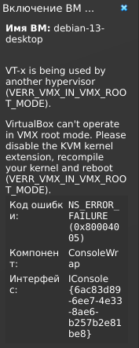

# Debian 13: настройка для бэкенд-инженера

## Интерфейс

### Раскладка

При установке ОС варианта Ctrl+Space в списке доступных сочетаний нет. Однако это можно настроить уже после завершения установки.

```bash
Настройки -> Диспетчер настроек -> Клавиатура -> Раскладка
```

Если на этапе установки ОС вы закрепили сочетание Ctrl+Shift для смены раскладки, возникнет проблема: оно будет конфликтовать с копированием и вставкой в терминале, так как именно Ctrl+Shift используется для этих действий. Более удачным вариантом будет назначить Ctrl+Space.

### Настройка темы

```bash
Настройки -> Диспетчер настроек -> Внешний вид -> Стиль -> Адвайта темная
Настройки -> Диспетчер настроек -> Внешний вид -> Значки -> Танго
Настройки -> Диспетчер настроек -> Внешний вид -> Шрифты -> Sans Regular 11
```

### Настройка панели

```bash
Панель -> Параметры панели  -> Экран -> Высота строки в пкс 34
```
Вид правой части панели:

<p align="center">
  
</p>

Вид левой части панели:

<p align="center">
  
</p>

### Обои

Установка [обоев рабочего стола](https://drive.google.com/drive/folders/1EI-dBV_NvpjpuhBZwcrxADebsoNSVzAx?usp=drive_link) и в качестве фона браузера.

## Настройка браузера

```bash
Настройки -> Основные -> Запуск -> Открыть предыдущие окна и вкладки [поставить галочку]
```

## Системные настройки

### Настройка пользователя

Для комфортной работы необходимо добавить основного пользователя в группу sudo, чтобы он имел права на выполнение команд от имени пользователя root.

```bash
su -
apt update
apt install sudo
usermod -aG sudo username
exit
su - $USER
sudo apt update
```

### Установка времени системы

```bash
sudo apt install gnome-system-tools
```

```bash
Настройки -> Диспетчер настроек -> Дата и время
```

### Установка английского языка для сообщений системы в терминале

```bash
nano ~/.bashrc
export LC_MESSAGES=C.UTF-8 
```

### Установка утилиты для работы Bluetooth

```bash
sudo apt update
sudo apt install bluetooth bluez blueman
```

- bluetooth / bluez — основной стек Bluetooth для Linux.
- blueman — графическая утилита для удобного управления (через системный трей или меню).

Добавляем на панель значок.

```bash
Настройки -> Диспетчер настроек -> Адаптеры bluetooth
```

### Установка базовых утилит и пакетов

#### Команды:

```bash
sudo apt install \
  curl wget ca-certificates gnupg2 openssl \
  git git-lfs \
  tmux bash-completion \
  tree ncdu file rename moreutils \
  ripgrep fd-find \
  bat
```

```bash
sudo apt install zip unzip p7zip-full unar
```

```bash
sudo apt install \
  build-essential gcc g++ make pkg-config \
  autoconf automake libtool m4 \
  flex bison re2c \
  gdb valgrind strace ltrace \
  man-db manpages manpages-dev
```

```bash
sudo apt install \
  openssh-client rsync \
  net-tools iproute2 dnsutils traceroute
```

```bash
sudo apt install \
  htop iotop btop glances
```

```bash
sudo apt install python3 python3-pip python3-venv
```

#### Описания:

**Сетевые утилиты:**

- curl — выполняет HTTP-запросы из терминала (GET/POST, с заголовками, с телом).
Пример: проверка API без браузера.
- wget — загружает файлы и страницы по HTTP/HTTPS/FTP.
Пример: скачать tar.gz с Go или deb-пакет.
- ca-certificates — набор корневых SSL-сертификатов; без них curl/wget будут выдавать ошибки при работе с HTTPS.
- gnupg2 — инструменты GPG для подписи и проверки пакетов и ключей.
Пример: проверка GPG-подписей Docker.
- openssl — работа с сертификатами, TLS и генерацией ключей.
Пример: создание самоподписанного сертификата для dev-сервера.

**Работа с Git:**

- git — система контроля версий, необходимый инструмент.
- git-lfs — расширение для хранения больших файлов (видео, бинарные данные).

**Терминальные инструменты:**

- tmux — мультиплексор терминала: позволяет открывать несколько панелей и сессий в одном окне, а также переподключаться после выхода из SSH.
- bash-completion — автодополнение в Bash (например, для git-команд или apt install). 

**Работа с файлами и деревьями:**

- tree — отображает дерево директорий и файлов.
Пример: показать структуру проекта.
- ncdu — интерактивная утилита для анализа занятого пространства на диске.
- file — определяет тип файла (ELF-бинарь, текстовый, PNG и т. д.).
- rename — пакетное переименование файлов по маске.
- moreutils — набор мелких утилит (sponge, ts, vidir и др.).
Пример: sponge позволяет читать и записывать в один и тот же файл в пайпах.

**Поиск:**

- ripgrep (rg) — очень быстрый поиск по содержимому файлов (альтернатива grep).
- fd-find (fdfind) — современная альтернатива find: удобнее синтаксис и выше скорость.

*Примечание для Debian: бинарь fd-find устанавливается под именем fdfind. Удобно добавить алиас:*

```bash
echo 'alias fd="fdfind"' >> ~/.bashrc
```

**Удобное чтение:**
- bat (batcat) — замена cat, подсвечивает синтаксис, показывает номера строк, удобно для чтения кода и конфигов.

*Примечание Debian: бинарь bat зовётся batcat. Удобный алиас:*

```bash
echo 'alias bat="batcat"' >> ~/.bashrc
```

**Архиваторы и работа с файлами:**

- zip - Классический формат ZIP (Windows-совместимый). Нужен для создания архивов. Используется, например, когда отправляешь клиенту готовый проект или пакуешь артефакты CI/CD.

Команда:

```bash
zip -r archive.zip my_project/
```

- unzip — утилита для распаковки архивов .zip.

Пример использования:

```bash
unzip archive.zip -d /tmp/test
```
- p7zip-full - Это порт 7-Zip для Linux. Содержит архиватор и разархиватор для множества форматов. 

    Умеет:

      - создавать и распаковывать форматы: 7z, zip, tar, gz, bz2, xz и др.;
      - только распаковывать (read-only) — часть старых форматов, включая RAR2 (старый стандарт RAR).

    ❌ Не умеет работать с современными RAR5 и не умеет создавать .rar вообще.

- unar — отдельная утилита (The Unarchiver). Это не архиватор, а именно разархиватор. Поддерживает RAR2, RAR5 и десятки других экзотических форматов. То есть unar нужен для распаковки современных RAR-архивов, которые p7zip-full не понимает.

**Компиляторы и базовый набор для сборки:**

- build-essential - метапакет, который тянет за собой gcc, g++, make и ещё несколько нужных пакетов. Без этих утилит нельзя ни собрать расширение для PHP, ни скомпилировать бинарник Go с C-зависимостями

**Автоматизация и «старые» тулзы сборки:**

- autoconf — генератор скрипта configure.
- automake — помогает создавать Makefile.in для автосборки.
- libtool — облегчает работу с динамическими библиотеками.
- m4 — макропроцессор, используется в autoconf.

Эти инструменты лежат в основе старой системы GNU Autotools. Они до сих пор востребованы при сборке старого ПО — например, PHP и многие библиотеки всё ещё используют их.

**Отладка и профилирование:**

- gdb — основной отладчик для C/C++. Подходит для отладки нативных расширений, а также Go- и PHP-бинарников (на уровне системных вызовов).

- valgrind — инструмент для поиска утечек памяти и профилирования. Полезен при работе с нативными библиотеками и PHP-расширениями.

- strace — отображает все системные вызовы процесса (open, read, write, connect и т. д.). Очень полезен при отладке.

- ltrace — показывает вызовы библиотечных функций (printf, malloc и т. д.).

👉 Эти инструменты — своего рода «рентген» для процессов: помогают понять, почему что-то не запускается или работает неправильно.

**Документация:**

- man-db — система man-страниц (man ls).
- manpages — сами страницы с документацией.
- manpages-dev — документация для функций из стандартной библиотеки C (например, man 2 open).


**Сетевые утилиты и диагностика:**

- openssh-client — клиент для работы по SSH: ssh, scp, sftp.
👉 Используется для подключения к серверам, копирования файлов или ключей. Must-have для любого backend-разработчика.

- rsync — умная синхронизация файлов и директорий. Работает локально и через SSH. Удобен для бэкапов, деплоя кода и зеркалирования каталогов. Поддерживает дельта-копирование (передаёт только изменения).

- net-tools — старый пакет, включает ifconfig, netstat, route. Сегодня считается устаревшим, но многие статьи и туториалы всё ещё используют ifconfig. Полезно иметь для совместимости.

- iproute2 — современная замена net-tools. Включает команды ip и ss.

Примеры:
```bash
ip a        # список интерфейсов  
ss -tlnp    # список открытых TCP-портов  
```

Для Debian и Linux в целом это основной инструмент работы с сетью.

- dnsutils — содержит dig и nslookup для проверки DNS-записей.
Пример:
```bash
dig google.com
nslookup github.com
```

- traceroute — показывает маршрут пакетов от клиента до сервера (через какие узлы проходит трафик). Используется для диагностики сетевых проблем.

- mtr-tiny — облегчённая версия утилиты mtr (My Traceroute). Объединяет возможности ping и traceroute, позволяя в реальном времени видеть статистику задержек и потерь на каждом хопе.

**Мониторинг потребления ресурсов:**

- htop — удобный просмотр процессов и использования ресурсов.
- iotop — мониторинг операций ввода-вывода.
- btop — альтернатива htop с более современным интерфейсом.
- glances — комплексный обзор всей системы (CPU, RAM, сеть, диск).

**Python как зависимость:**

Python часто требуется для утилит и скриптов, которые могут понадобиться в работе.

- python3 — интерпретатор Python 3.
- python3-pip — менеджер пакетов pip.
- python3-venv — модуль для создания виртуальных окружений.

## Настройка терминала

Я использую эмулятор терминала tilix.
```bash
sudo apt install tilix
```

Терминал по умолчанию.
```bash
Настройки -> Диспетчер настроек ->приложения по умолчанию -> Утилиты -> Терминал
```
Добавить tilix на "Панель запуска приложений".
```bash
Панель -> Добавить новые элементы -> Значок запуска
Значок запуска -> Свойства -> Там устанавливаем через “+” приложение.
```


Установка цветовых стилей для tilix:
```bash
sudo apt install dconf-cli
bash -c  "$(wget -qO- https://git.io/vQgMr)"
```

## Структура директорий 

Базовая структура домашней директории может выглядеть так:
```bash
bin
code
    \ personal
      work
knowledge_base
my_configs
```

- bin — бинарники, которые вы пишете для себя и используете на уровне системы. Обычно директория ~/bin добавляется в переменную окружения $PATH.

```bash
export PATH=$PATH:/home/vysmv/bin 
```

- code — директория, в которой параллельно хранятся персональные и рабочие проекты.
- knowledge_base — директория для хранения книг, гайдов и прочих материалов.
- my_configs — набор конфигов, которые стоит сохранять на случай переустановки системы.

## Основные инструменты

### Установка PHP и Composer

```bash
sudo apt update
sudo apt install \
    php php-cli php-fpm php-common \
    php-mbstring php-xml php-bcmath php-curl php-zip php-intl php-mysql \
    php-gd php-imagick
```
```bash
sudo apt install composer
```

### Установка Go

- Скачиваем: https://go.dev/dl/
- Удаляем старую версию: sudo rm -rf /usr/local/go
- Устанавливаем в /usr/local: sudo tar -C /usr/local -xzf go1.24.0.linux-amd64.tar.gz
- Добавляем бинарь в $PATH
```bash 
nano ~/.bashrc
export PATH=$PATH:/usr/local/go/bin
source ~/.bashrc
go version
```

### Установка Node Js и  NPM
```bash
curl -fsSL https://deb.nodesource.com/setup_20.x | sudo -E bash -
sudo apt install -y nodejs
node -v
npm -v
```

### Установка Docker engine и Docker compose
Подготовка:
```bash
sudo apt install ca-certificates curl gnupg lsb-release
```
Добавляем GPG-ключ Docker:
```bash
sudo install -m 0755 -d /etc/apt/keyrings
curl -fsSL https://download.docker.com/linux/debian/gpg | \
  sudo gpg --dearmor -o /etc/apt/keyrings/docker.gpg
sudo chmod a+r /etc/apt/keyrings/docker.gpg
```
Подключаем репозиторий Docker:
```bash
echo \
  "deb [arch=$(dpkg --print-architecture) signed-by=/etc/apt/keyrings/docker.gpg] \
  https://download.docker.com/linux/debian \
  $(lsb_release -cs) stable" | \
  sudo tee /etc/apt/sources.list.d/docker.list > /dev/null
```

Устанавливаем Docker Engine/Compose:
```bash
sudo apt update
sudo apt install docker-ce docker-ce-cli containerd.io docker-buildx-plugin docker-compose-plugin
```

Проверка:
```bash
docker --version
docker compose version
```

Работа без sudo:
```bash
sudo usermod -aG docker $USER
su - $USER
```

Проверить наличие новой группы:
```bash
id
groups
```

### Установка клиентов для баз данных
```bash
sudo apt install mariadb-client postgresql-client redis-tools
```

**Клиент баз данных:**

- mariadb-client - В Debian пакета mysql-client может не быть (он заменён на mariadb-client, который полностью совместим). 
Пример:
```bash
mysql -h 127.0.0.1 -P 3306 -u root -p
```

- postgresql-client - клиент для коннекта с postgresql сервером. 
Пример:
```bash
psql -h 127.0.0.1 -p 5432 -U postgres -d mydb
```

- redis-tools - клиент для коннекта с redis сервером
Пример:
```bash
redis-cli -h 127.0.0.1 -p 6379
```

### Установка VirtualBox

Скачиваем deb пакет:
```bash
https://www.virtualbox.org/wiki/Linux_Downloads
```

Устанавливаем:
```bash
sudo apt install ./virtualbox-7.2_7.2.2-170484~Debian~trixie_amd64.deb
```

> **Важно!**
>
> На этапе установки в логах процесса может появится такой текст
> ```bash
> System is running in Secure Boot mode ...
> Please consider to generate and enroll keys manually ... 
>
> Это приведёт к тому, что при попытке запуска образа VirtualBox выдаст ошибку:

<p align="center">
  
</p>

> В этом случае необходимо зайти в BIOS/UEFI → Secure Boot → Disabled, сохранить настройки и перезагрузить.
>
> После этого появится другая ошибка:

<p align="center">
  
</p>

> Это означает, что VirtualBox пытается использовать ресурс виртуализации, который уже использует KVM.
> Так как KVM для меня слишком низкоуровневый инструмент, я отключаю загрузку модулей KVM.
> Вводим:
> ```bash
> lsmod | grep kvm
> ```
> И если результат содержит: 
> ```bash
> kvm_intel             413696  0
> kvm                  1396736  1 kvm_intel
> ```
> 
> Значит так и есть. Причина в этом. 
> Выполняем:
>```bash
> echo "blacklist kvm" | sudo tee /etc/modprobe.d/blacklist-kvm.conf
> echo "blacklist kvm_intel" | sudo tee -a /etc/modprobe.d/blacklist-kvm.conf
> # или если у тебя AMD:
> # echo "blacklist kvm_amd" | sudo tee -a /etc/modprobe.d/blacklist-kvm.conf
> ```
> Теперь перезагружаем систему и пробуем запустить. Всё должно работать.

### Установка Postman

Скачиваем:
```bash
https://www.postman.com/downloads/
```

Устанавливаем:
```bash
sudo tar -C /usr/local -xzf postman-linux-x64.tar.gz
```

Делаем ссылку для запуска postman из консоли:
```bash
sudo ln -s /usr/local/Postman/Postman /usr/local/bin/postman 
```

Добавляем на панель запуска.

### Установка Filezilla
```bash
sudo apt update
sudo apt install filezilla
```

Добавляем на панель запуска.

### Установка VS CODE

Скачиваем с оф. сайта deb пакет.

Устанавливаем:
```bash
sudo apt install ./code_1.104.1-1758154125_amd64.deb
```

Добавляем на панель запуска.

Интеграция сохраненных профилей.

### Установка менеджера паролей keepass

```bash
sudo apt update
sudo apt install keepassxc
```

## Дополнительные инструменты

### [Установка vpn Proton:](https://protonvpn.com/support/official-linux-vpn-ubuntu/)
```bash
wget https://repo.protonvpn.com/debian/dists/stable/main/binary-all/protonvpn-stable-release_1.0.8_all.deb
```

```bash
sudo dpkg -i ./protonvpn-stable-release_1.0.8_all.deb && sudo apt update
```

```bash
echo "0b14e71586b22e498eb20926c48c7b434b751149b1f2af9902ef1cfe6b03e180 protonvpn-stable-release_1.0.8_all.deb" | sha256sum --check -
```

```bash
sudo apt install proton-vpn-gnome-desktop
```

### Установка яндекс браузера

Это понадобится на случай, если возникнет необходимость смотреть иностранные видео с голосовым переводом.

Качаем dep:
```bash
https://browser.yandex.ru/#browser
```

Установка:
```bash
sudo apt install ./Yandex.deb
```

### Установка Team viewer

Это понадобится, если нужно настроить удалённый доступ к другим компьютерам.

Скачиваем deb пакет:
```bash
https://www.teamviewer.com/ru-cis/download/linux/
```

Устанавливаем:
```bash
sudo apt install ./teamviewer_15.69.4_amd64.deb
```

### Установка ScreenRecorder

Осуществляет запись экрана. 

```bash
sudo apt update
sudo apt install simplescreenrecorder
```

### Установка redshift

Для защиты глаз. Конфиг можно править под себя.

```bash
sudo apt update
sudo apt install redshift redshift-gtk
```

```bash
копирование конфига в ~/.config/redshift.conf из ~/configs/redshift.conf
```

### Установка скриншотера flameshot
```bash
sudo apt update
sudo apt install flameshot
```

## Настройка SSH доступа к git

Создаем директорию .ssh
```bash
sudo chmod 700 ./.ssh
```

Вставляем ключи и конфиг из ~/configs и выполняем
```bash
sudo chmod 600 ./id_*
```

Детальное описание этого процесса можно посмотреть [тут](). 