# Debian 13 — установка в режиме «Expert»

> *Дисклеймер:*
>
> Прошу не обращать внимания на качество фотографий. Снимал на старый и слегка поломанный телефон. Другого в тот момент не было, а работу нужно было выполнить.
Конечно, я мог сделать скриншоты установки в VirtualBox, но там отсутствуют некоторые важные моменты процесса. Поэтому решил: пусть менее наглядно, но зато более полезно 🙂. 

## 1. Этап «Выбор типа установки»

<p align="center">
  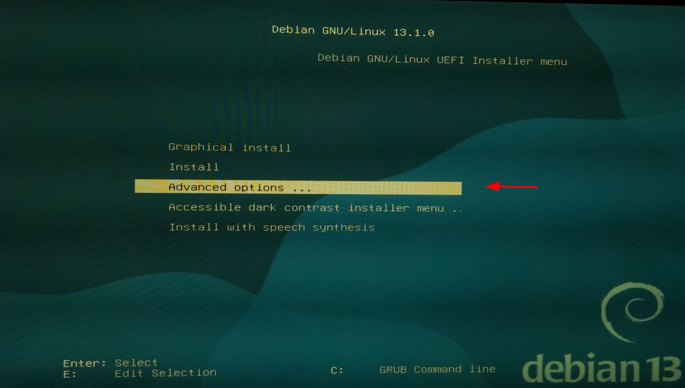
</p>

<p align="center">
  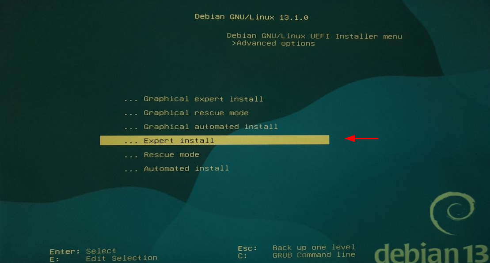
</p>

## 2. Этап «Выбор языка»

Этот экран отвечает за выбор языка процесса установки, а также языка по умолчанию для установленной системы.

<p align="center">
  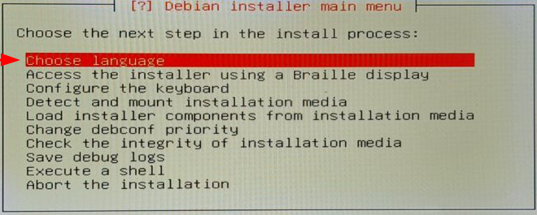
</p>

Я выбираю русский язык для локализации рабочей системы. Позже, уже в установленной системе, внесу изменения: язык системных сообщений в терминале будет английским, а интерфейс останется русским.

<p align="center">
  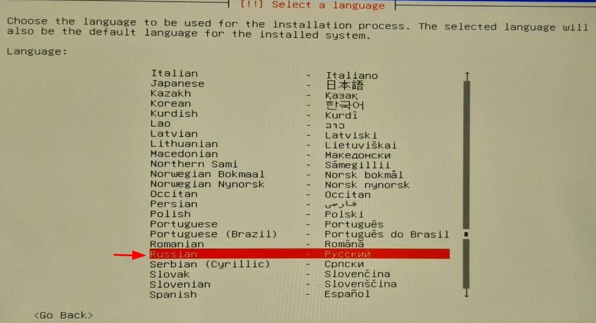
</p>

Далее нужно выбрать регион для корректной установки часового пояса, а также форматов дат и единиц измерения. Регион можно определить либо из списка «другая», либо из верхнеуровневого списка. Далее, на основе комбинации выбранной страны и языка будет предложено выбрать локаль по умолчанию. Выберите ту, которая вам больше подходит.

<p align="center">
  
</p>

Также есть возможность установить дополнительные локали. Мне это не требуется, поэтому просто продолжаем.

<p align="center">
  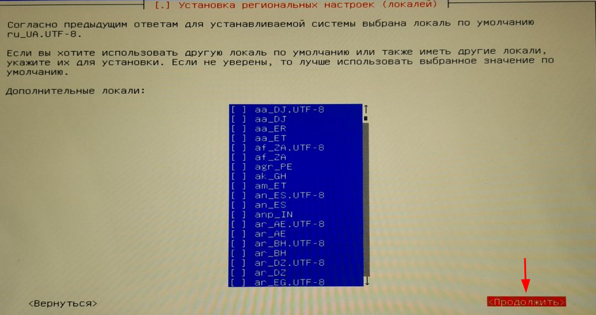
</p>

## 3. Этап «Access the installer using a Braille display» 

Я пропускаю. Это настройки оборудования для слабовидящих.

<p align="center">
  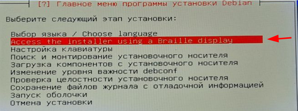
</p>

## 4. Этап «Настройка клавиатуры»

<p align="center">
  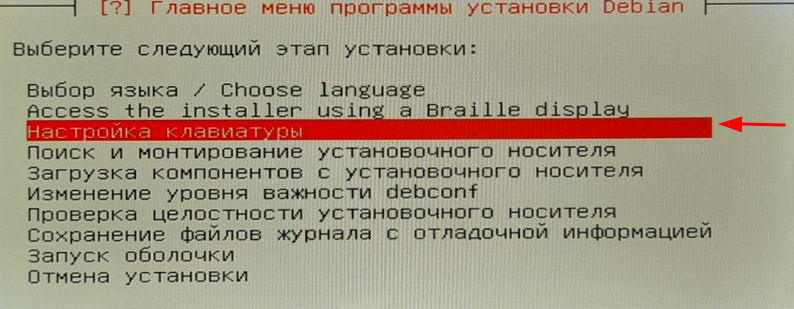
</p>

Устанавливаю русский язык.

<p align="center">
  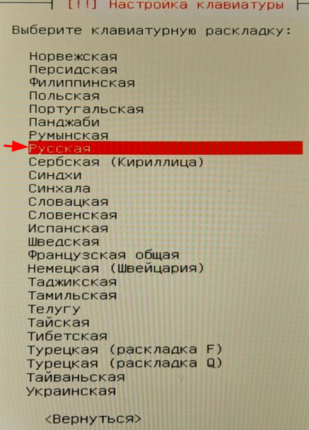
</p>

Определяю комбинацию смены раскладки.

<p align="center">
  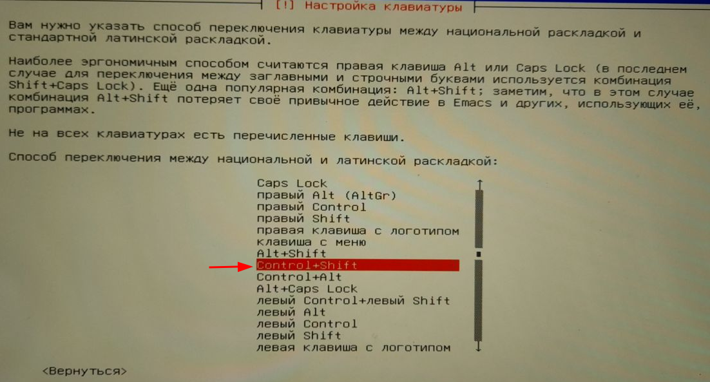
</p>

## 5. Этап «Поиск и монтирование установочного носителя» 

Это шаг, на котором установщик проверяет:

- доступность установочного ISO-образа или физического носителя (DVD, USB);
- выполняет его монтирование, чтобы затем можно было загружать пакеты, драйверы и компоненты системы.

<p align="center">
  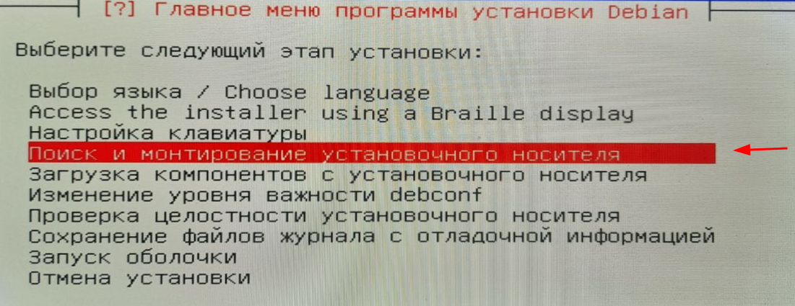
</p>

Если все в норме, то увидим такое окно. Продолжаем.

<p align="center">
  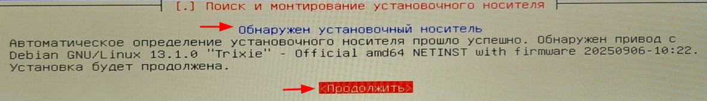
</p>

## 6. Этап «Загрузка компонентов с установочного носителя»

На этом шаге установщик подтягивает из ISO-образа все необходимые пакеты и драйверы, обеспечивающие дальнейшие этапы установки.

<p align="center">
  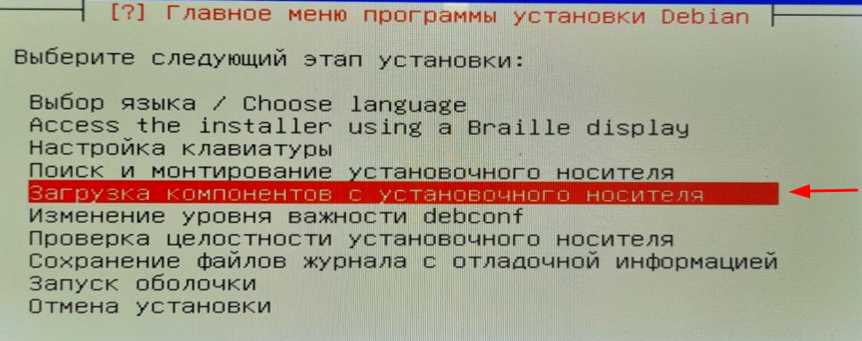
</p>

Также система предложит установить набор дополнительных пакетов. Я пропускаю этот шаг, так как они не нужны для моей работы.

<p align="center">
  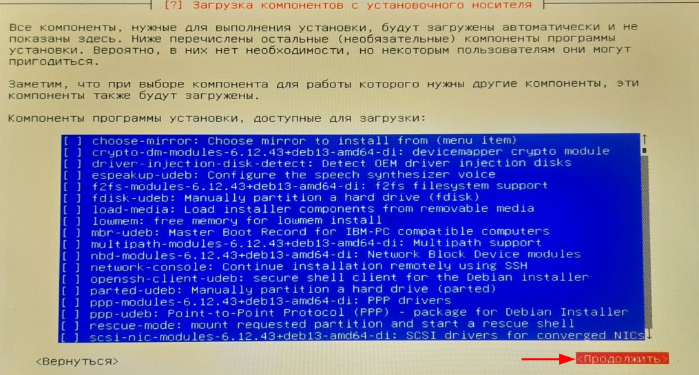
</p>

> *После установки обязательных пакетов и драйверов изменилось количество пунктов в верхнем меню. Это нормально.*

## 7. Этап «Определение сетевой карты»

Просто запускаем процесс — он завершится автоматически.

<p align="center">
  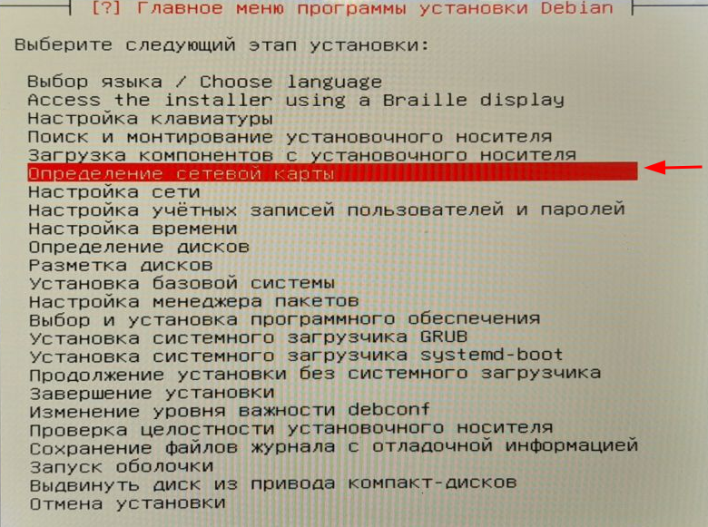
</p>

## 8. Этап «Настройки сети»

<p align="center">
  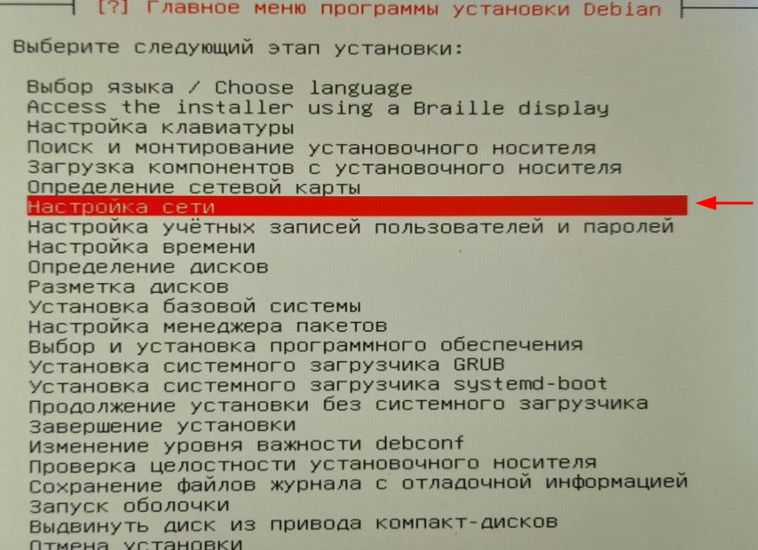
</p>

Устанавливаем время ожидания соединения (10 секунд) и продолжаем. Возможно, это окно появится несколько раз подряд для разных сетевых интерфейсов.

<p align="center">
  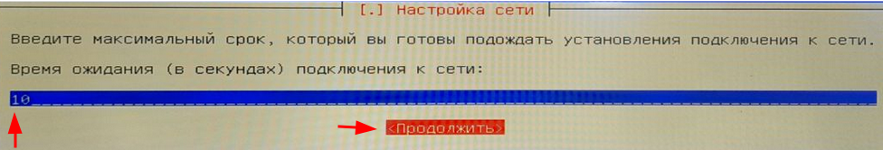
</p>

Система обнаруживает интерфейсы. Я выбираю беспроводной, так как Wi-Fi наиболее удобный для меня способ.

<p align="center">
  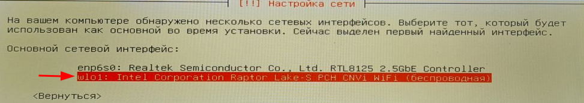
</p>

Далее подключаюсь к своей домашней сети.

<p align="center">
  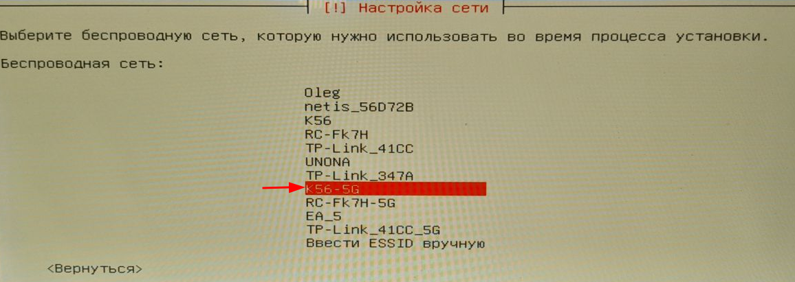
</p>

После этого выбираю защищённый тип соединения, так как у меня установлен пароль.
<p align="center">
  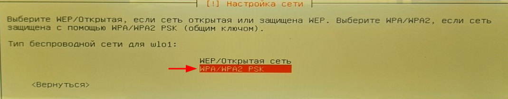
</p>

Указываю пароль и продолжаю.

<p align="center">
  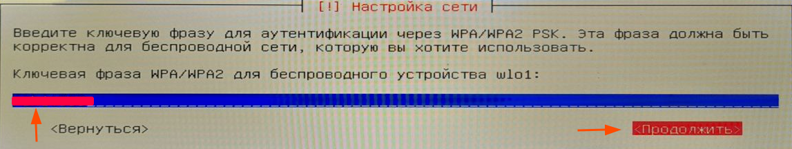
</p>

Проблем с автоматической настройкой сети у меня не возникло, поэтому использую именно этот режим.

<p align="center">
  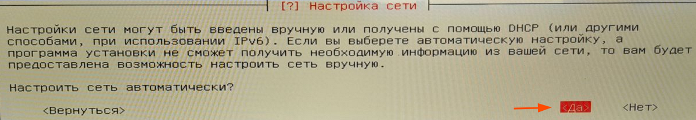
</p>

Выделяю на соединение с сервером 10 секунд и продолжаю.

<p align="center">
  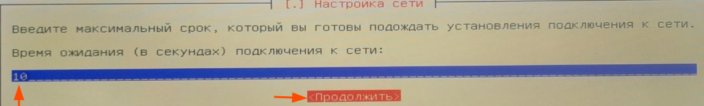
</p>

Далее необходимо указать имя компьютера и продолжить.

<p align="center">
  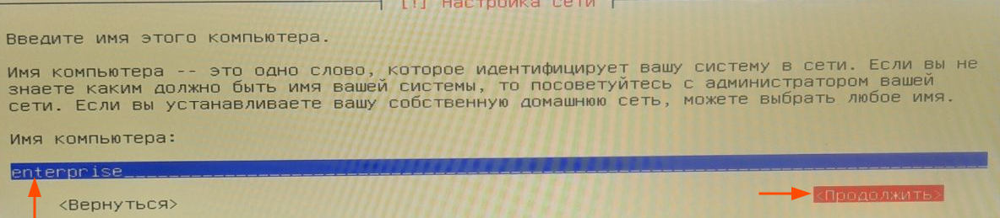
</p>

Имя домена можно оставить пустым. 

<p align="center">
  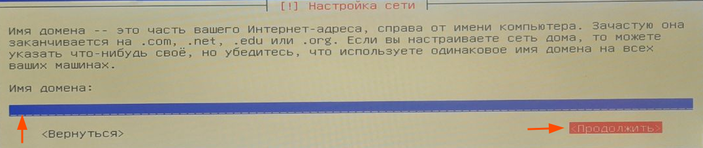
</p>

## 9. Этап «Настройка учетных записей»

<p align="center">
  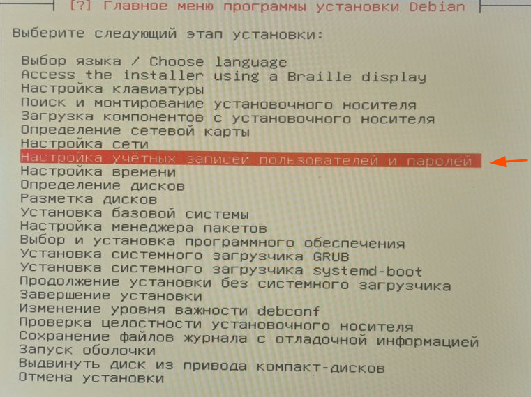
</p>

Естественно, что мы разрешаем вход под суперпользователем root.

<p align="center">
  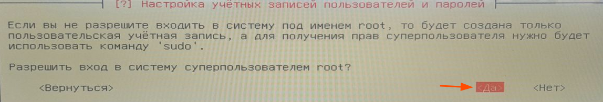
</p>

Устанавливаем пароль для пользователя root и продолжаем.

<p align="center">
  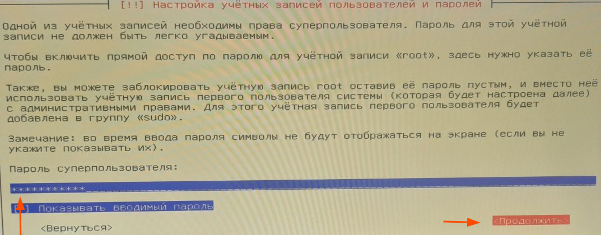
</p>

Повторяем пароль.

<p align="center">
  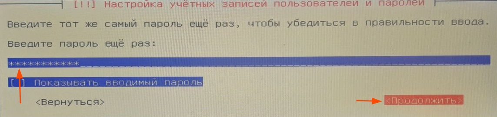
</p>

Создаем базового юзера.

<p align="center">
  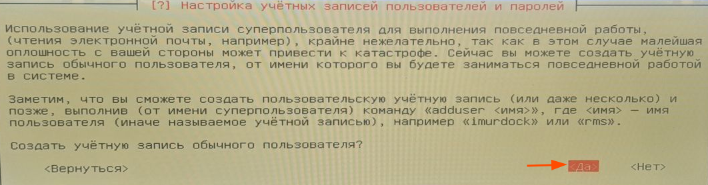
</p>

Основные правила для имён пользователей:

- Символы: допустимы только латинские строчные буквы (a–z), цифры (0–9), подчёркивание (_) и дефис (-); запрещены пробелы, точки, заглавные буквы и спецсимволы.
- Первый символ: должен быть буквой или подчёркиванием (a–z или _); имя не может начинаться с цифры или дефиса.
- Длина: рекомендуется использовать до 32 символов.
- Уникальность: имя должно быть уникальным в системе и не совпадать с другим пользователем или системным аккаунтом.

<p align="center">
  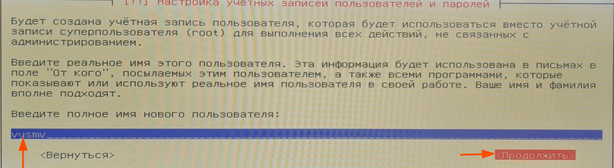
</p>

Повторяем и продолжаем.

<p align="center">
  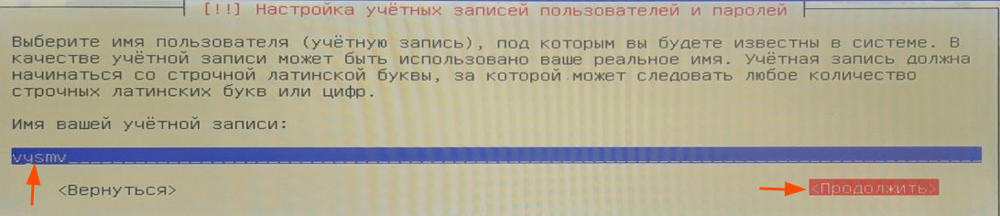
</p>

Создаем пароль для базового пользователя.

<p align="center">
  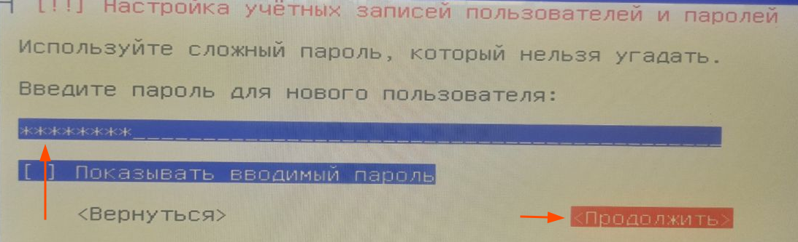
</p>

Повторяем и продолжаем.

<p align="center">
  
</p>

## 10. Этап «Настройка времени»

<p align="center">
  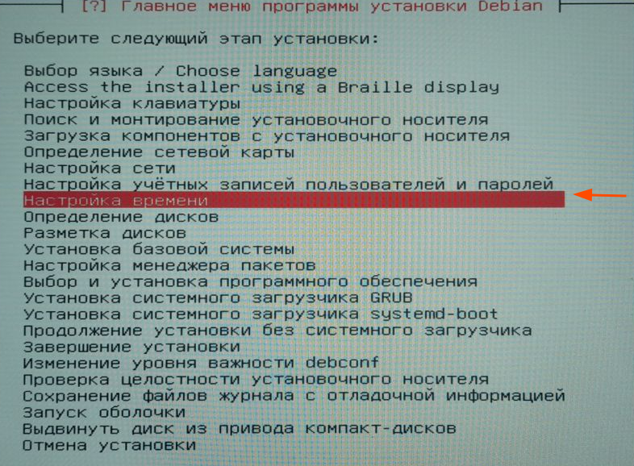
</p>

Соглашаемся использовать NTP. 

<p align="center">
  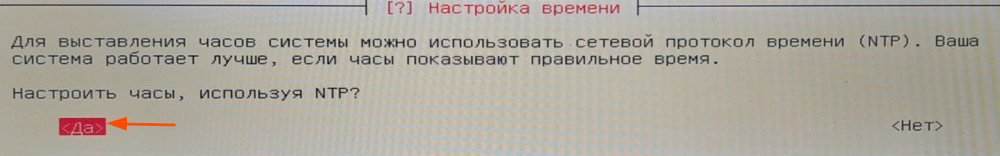
</p>

Оставляем сервер по умолчанию и продолжаем. Далее выбираем свой часовой пояс.

<p align="center">
  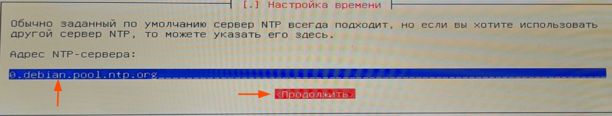
</p>

## 11. Этап «Определение дисков»
Процесс выполнится и завершится автоматически.

<p align="center">
  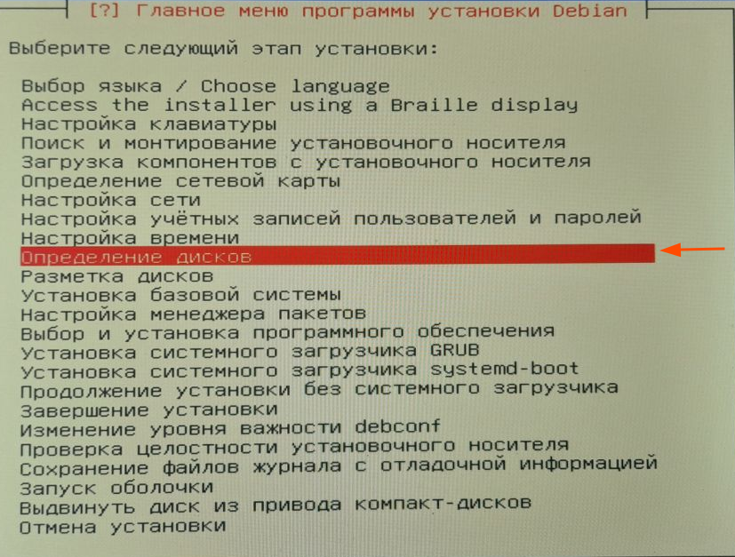
</p>

## 12. Этап «Разметка дисков»

<p align="center">
  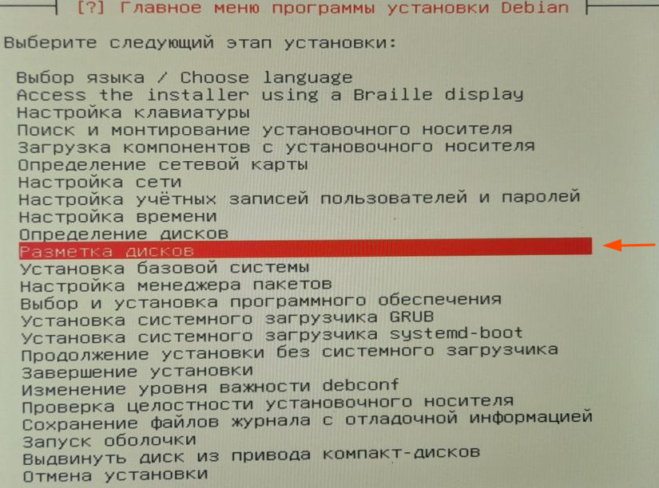
</p>

Выбираем «Вручную».

<p align="center">
  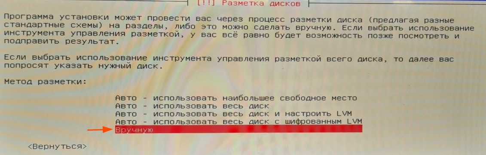
</p>

У каждого пользователя может быть своя конфигурация устройств: у кого-то только SSD или HDD, у кого-то комбинация SSD+HDD.

Для себя я придерживаюсь следующей схемы разметки:

- `/` — 150 GB (корень, система и программы);

- `/boot` — 1 GB (ядра и загрузчик);

- `/efi` — 1 GB (раздел для UEFI);

- `swap` — 6 GB (виртуальная память);

- `/home` — всё оставшееся место на SSD;

- при наличии HDD подключаю его отдельно в `/storage`.

> *Важно!*
>
> У вас может быть полностью новый ПК с новым диском. В этом случае разделы еще не будут созданы. Следовательно вы не будете видеть, как в моих примерах, диск с пометкой «свободное место». Например так:

<p align="center">
  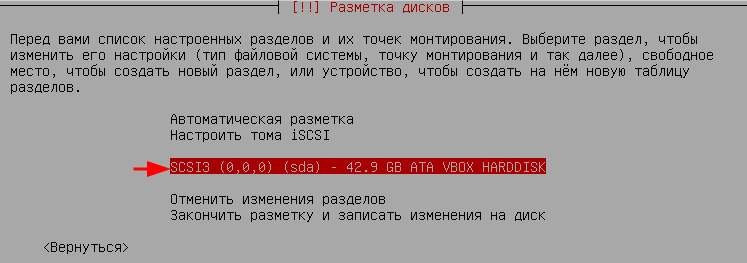
</p>

> Вам нужно перейти к устройству и сначала создать таблицу разделов. Если не вдаваться в подробности, то:
> - для современных компьютеров используйте таблицу GPT;
> - для сильно устаревших моделей — MBR.
> - Если вы не уверены, к какой категории относится ваше устройство, то:
>    - На реальном ПК:
>        - если в BIOS/UEFI есть пункт «UEFI Boot» или «Secure Boot» → лучше использовать GPT;
>        - если доступен только «Legacy BIOS» → тогда выбирайте MBR.
>    - В VirtualBox:
>        - Настройки VM → Система → вкладка «Материнская плата» → если включена галочка EFI, создавайте GPT;
>        - если EFI выключен → можно выбрать MBR, но и GPT будет работать, загрузчик GRUB установится.

Начинаем с разметки SSD. 

<p align="center">
  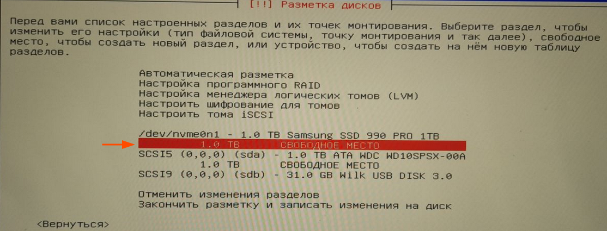
</p>

Создаем новый раздел.

<p align="center">
  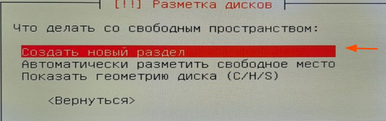
</p>

Выделяем под него 150GB и продолжаем. 

> *Важно!*
>
> По моему опыту, указанного объёма достаточно. Но если вы используете в работе большое количество пакетов или запускаете много проектов в Docker, лучше взять 200 GB. Впрочем, ориентируйтесь на свой опыт и потребности.

<p align="center">
  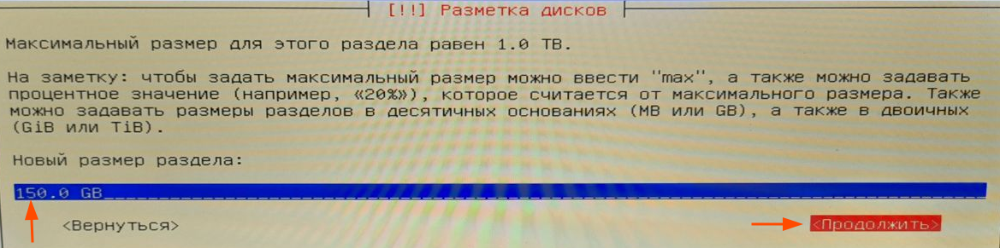
</p>

Определяем положение раздела на дисковом пространстве.

<p align="center">
  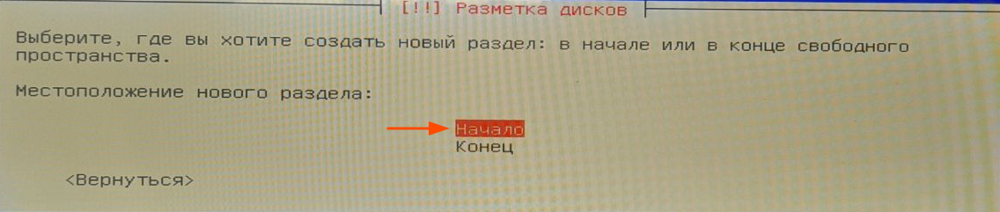
</p>

> *Интересно!*
>
> Вопрос «Начало или конец» означает, куда именно будет размещён новый раздел в пределах свободного пространства — в начале или в конце.
>
> Как это работает:
> - Начало (Beginning) → раздел создаётся с самого начала незанятой области.
> - Конец (End) → раздел создаётся в самом конце свободной области.

> Для HDD это имело значение:
> - начало ближе к внешнему краю диска → скорость чтения и записи выше;
> - конец ближе к внутреннему краю → скорость ниже.
>
> Для SSD разницы нет: 
> - доступ равномерный по всему пространству. 
> - Поэтому этот выбор влияет только на порядок расположения разделов, но не на производительность.

Оформляем раздел в соответствии со значениями на скрине и заканчиваем настройку.

<p align="center">
  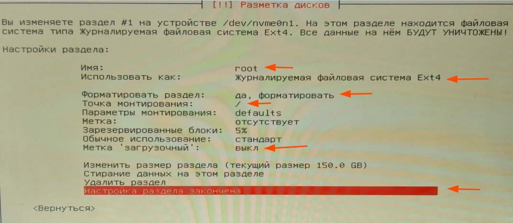
</p>

Берем следующую часть свободного пространства.

<p align="center">
  
</p>

Создаем новый раздел.

<p align="center">
  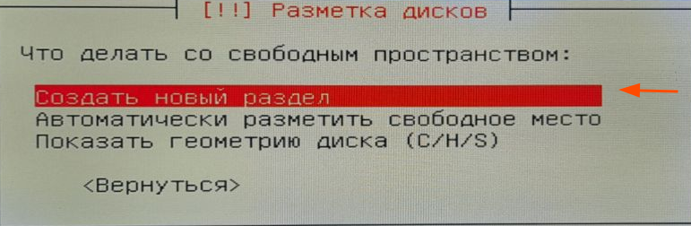
</p>

Выделяем пространство (в моём случае — 842 GB) в «Начало».

<p align="center">
  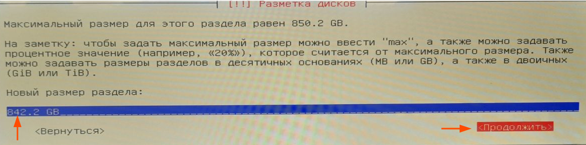
</p>

<p align="center">
  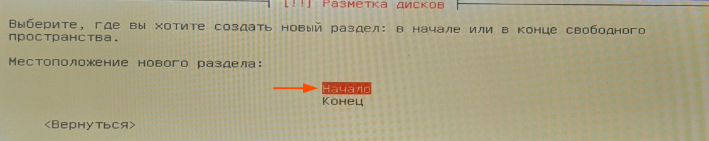
</p>

Оформляем раздел в соответствии со значениями на скриншоте и завершаем настройку.

<p align="center">
  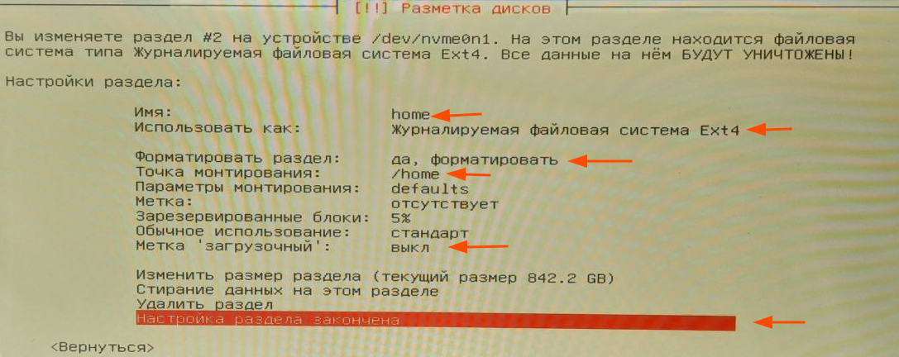
</p>

Берем следующий фрагмент свободного места и создаем раздел.

<p align="center">
  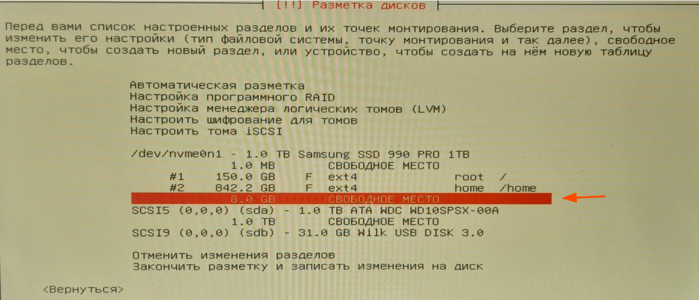
</p>

<p align="center">
  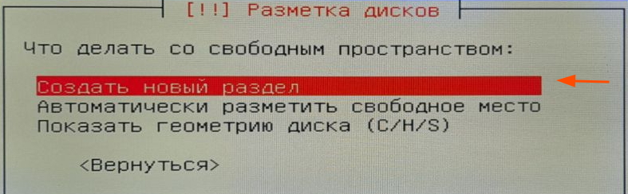
</p>

Выделяем пространство (в моём случае — 2 GB, хотя на практике достаточно и 1 GB) в «Начало».

<p align="center">
  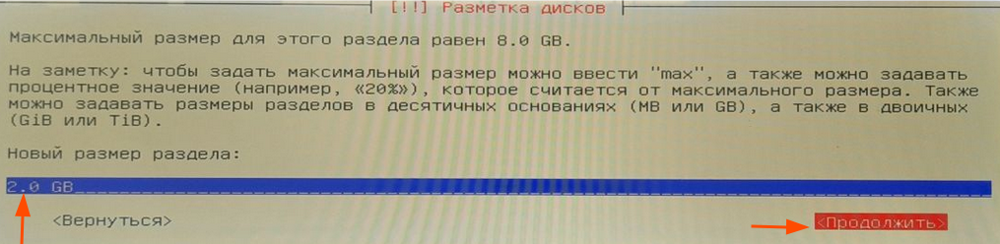
</p>

<p align="center">
  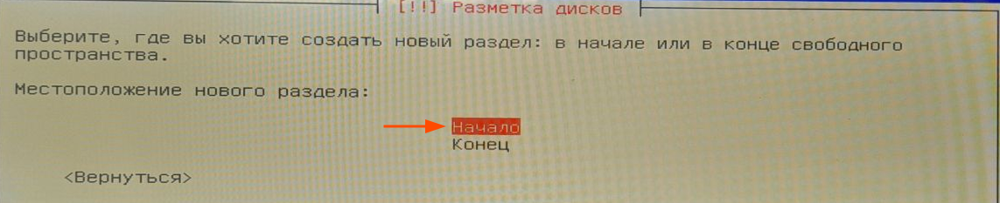
</p>

Оформляем раздел в соответствии со значениями на скриншоте и завершаем настройку.

> *Интересно!*
>
> Лучше включить метку «загрузочный». Однако в режиме UEFI (с таблицей GPT) это уже не критично.

<p align="center">
  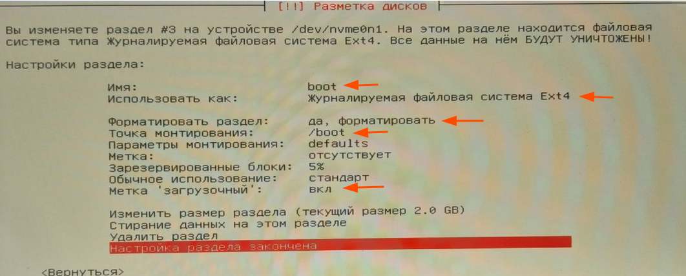
</p>

Берем следующий фрагмент свободного места.

<p align="center">
  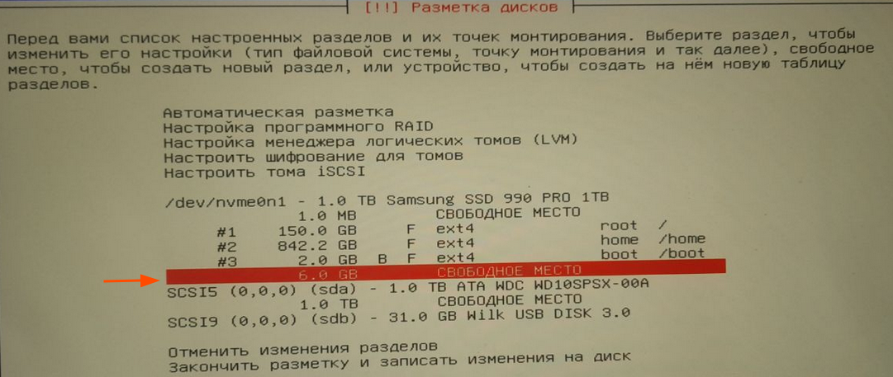
</p>

Создаем раздел.

<p align="center">
  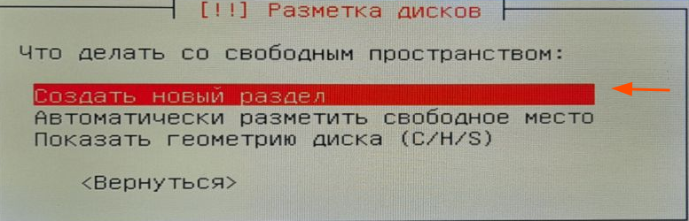
</p>

Выделяем пространство (в моём случае — 1 GB) в «Начало».

<p align="center">
  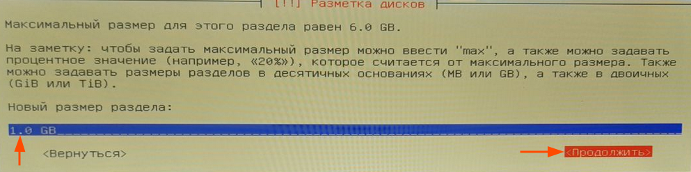
</p>

<p align="center">
  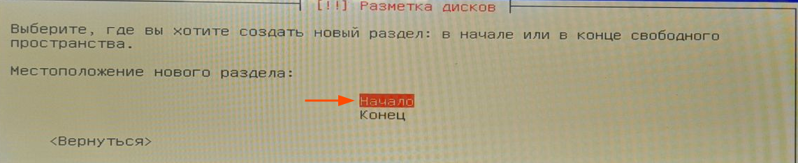
</p>

Оформляем раздел в соответствии со значениями на скриншоте и завершаем настройку.

<p align="center">
  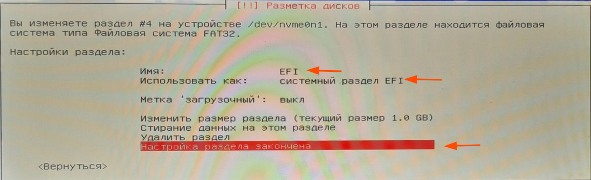
</p>

Берем следующий фрагмент свободного пространства.

<p align="center">
  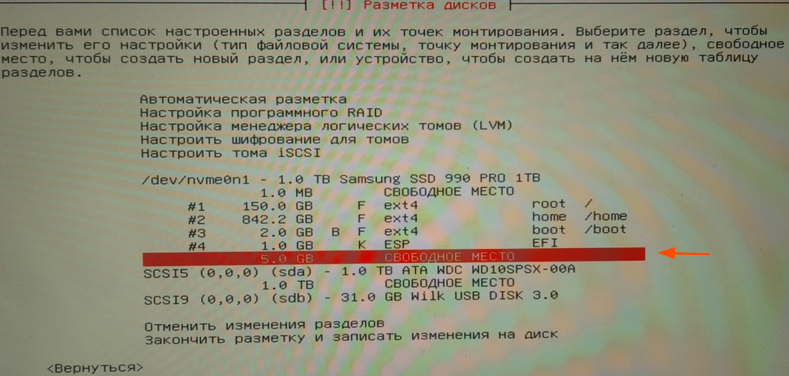
</p>

Создаем раздел.

<p align="center">
  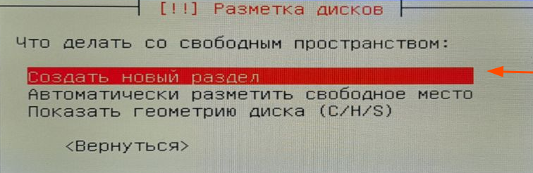
</p>

Выделяем пространство (в моём случае — 5 GB) в «Начало».

<p align="center">
  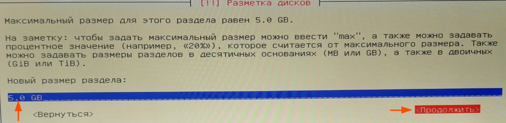
</p>

Оформляем раздел в соответствии со значениями на скриншоте и завершаем настройку.

<p align="center">
  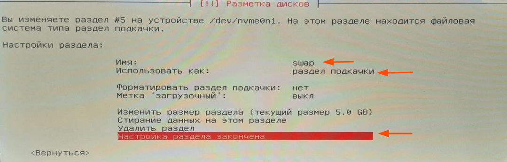
</p>

Так как помимо SSD у меня есть и HDD, я просто монтирую его в каталог «/storage». Затем перехожу к свободному пространству HDD.

<p align="center">
  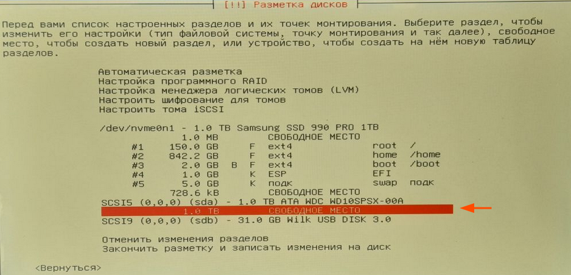
</p>

Создаем раздел.

<p align="center">
  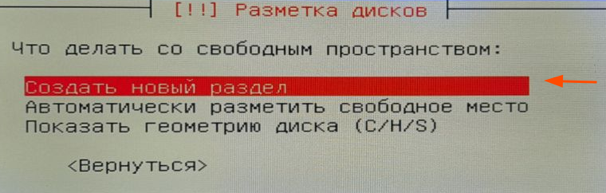
</p>

Выделяем пространство (в моём случае — 1 TB) в «Начало».

<p align="center">
  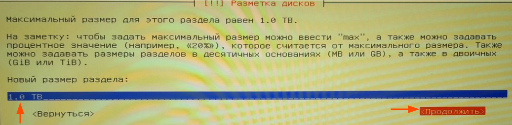
</p>

Оформляем раздел в соответствии со значениями на скриншоте и завершаем настройку. Точку монтирования «/storage» нужно создать вручную, так как в списке стандартных её нет.

<p align="center">
  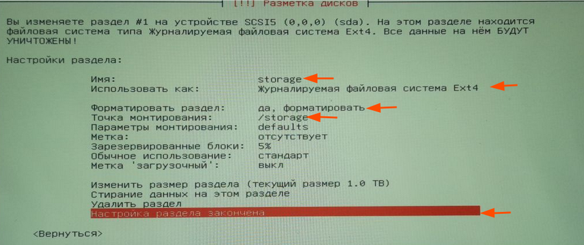
</p>

Заканчиваю разметку.

<p align="center">
  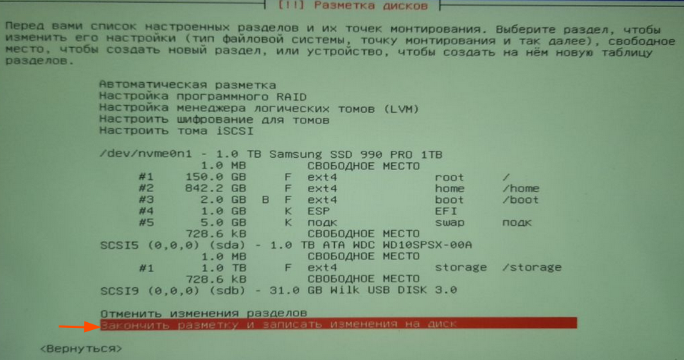
</p>

Записываю изменения.

<p align="center">
  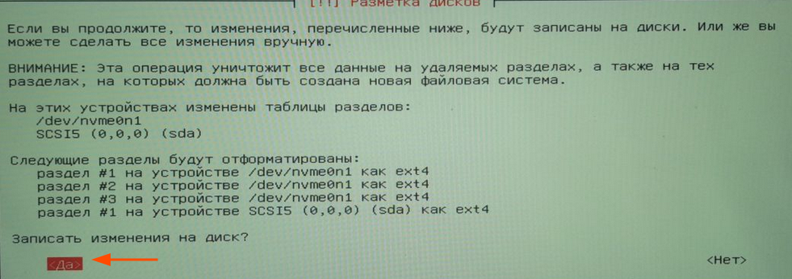
</p>

## 13. Этап «Установка базовой системы»

<p align="center">
  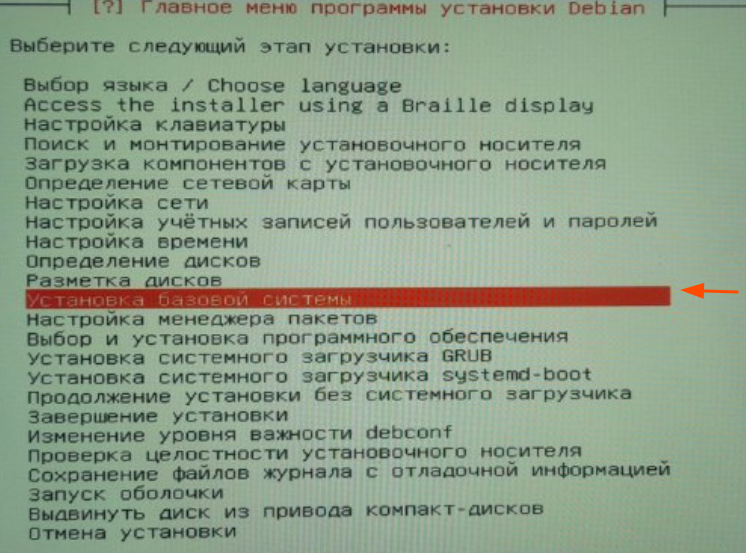
</p>

Выбираем ядро linux-image-amd64. Это не конкретная версия, а своего рода метка, указывающая на актуальную версию ядра. Если вы не хотите самостоятельно заниматься обновлениями безопасности ядра, выбирайте именно этот вариант.

<p align="center">
  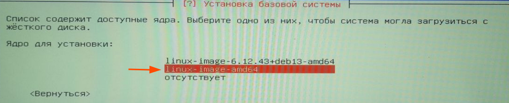
</p>

На мой взгляд, для домашней системы лучше устанавливать общий набор драйверов, так как специализированный может не содержать некоторых необходимых.

<p align="center">
  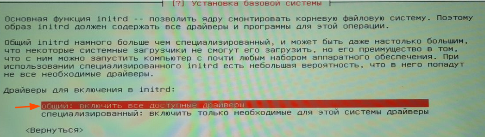
</p>

## 14. Этап «Настройка менеджера пакетов»

<p align="center">
  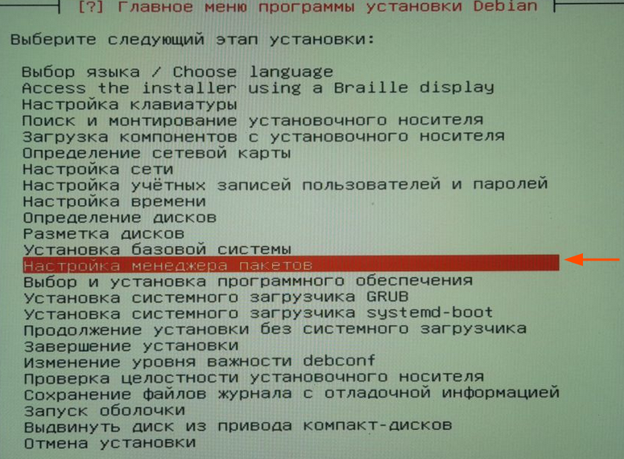
</p>

Активируем использование пакетов из внешнего зеркала.

<p align="center">
  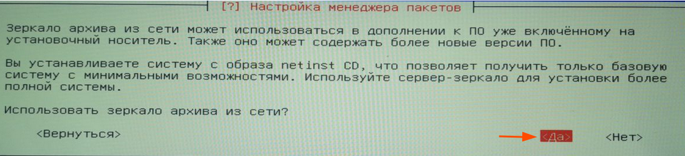
</p>

Вариант по умолчанию — «http» — вполне подойдёт. Далее указываем страну пребывания, чтобы использовалось ближайшее зеркало для скачивания пакетов, и выбираем любой из предложенных серверов.

<p align="center">
  
</p>

Настраивать HTTP-прокси мне не требуется. 

<p align="center">
  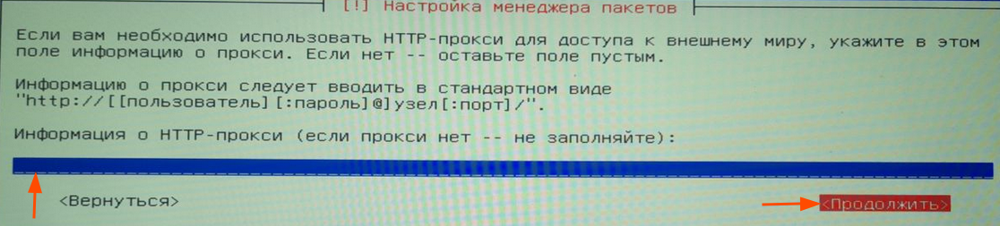
</p>

Далее установщик спрашивает, разрешить ли использование несвободных микропрограмм (firmware).

Что это значит:

- Свободные драйверы (free firmware) → входят в Debian по умолчанию.
- Несвободные драйверы (non-free firmware) → могут потребоваться для работы некоторых Wi-Fi-карт, видеокарт, звуковых устройств и т. п.
Примеры: Broadcom Wi-Fi, некоторые AMD/NVIDIA GPU.

Если выбрать «Нет», система будет полностью «чистой» с точки зрения лицензий, но часть оборудования может не заработать.

Поэтому выбираем «Да» — нам нужна максимальная работоспособность.

<p align="center">
  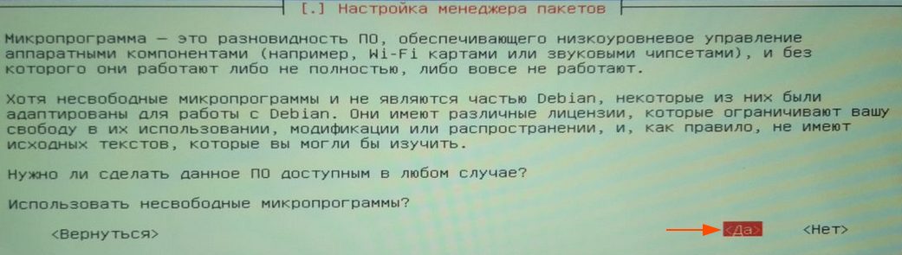
</p>

Предыдущий экран касался несвободных микропрограмм (firmware), а теперь речь идёт о несвободных пакетах ПО (non-free software).

Разница:

- Firmware — драйверы для оборудования (Wi-Fi, GPU, звук и т. п.). Без них устройства могут вообще не заработать.
- Non-free software — обычные программы или библиотеки с несвободными лицензиями (например, некоторые кодеки, утилиты для архивов, проприетарные инструменты).

Поэтому снова выбираем «Да», если хотим иметь доступ ко всем видам ПО.

<p align="center">
  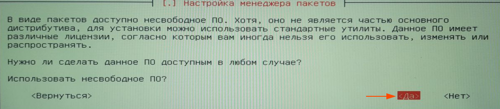
</p>

Далее установщик спрашивает, нужно ли подключить репозитории исходных пакетов (deb-src) в APT.

- Если не знаете, зачем это нужно → смело выбирайте «Нет».
- Если бывает интересно работать с исходниками или есть вероятность, что придётся пересобирать пакеты → оставляйте включённым.

Главное, что решение не окончательное: эти строки легко добавить или убрать позже вручную в файле /etc/apt/sources.list.

Я не включаю исходники пакетов, так как пока не сталкивался с их необходимостью.

<p align="center">
  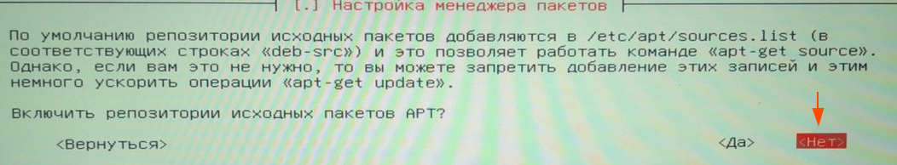
</p>

Экран «Настройка менеджера пакетов» предлагает включить три вида репозиториев:

- Обновления безопасности (security.debian.org)
✅ обязательно оставить включённым.
Здесь публикуются патчи безопасности для ядра и программ.

- Обновления выпуска
✅ тоже лучше оставить включённым.
В этом репозитории появляются исправления ошибок и новые версии ПО, признанные безопасными для текущего стабильного релиза.

- Backports (бэкпортированное ПО)
⬜ по умолчанию выключено — и это правильное решение.
Содержит более свежие версии пакетов, собранные под стабильный Debian. Они не устанавливаются автоматически, но при необходимости их можно добавить вручную через:

```bash
apt -t bookworm-backports install ...
```

Удобно для разработчиков, если нужен свежий софт (например, новая версия PHP, Go, Node.js и т. п.).

Оставляем настройки по умолчанию и продолжаем.

<p align="center">
  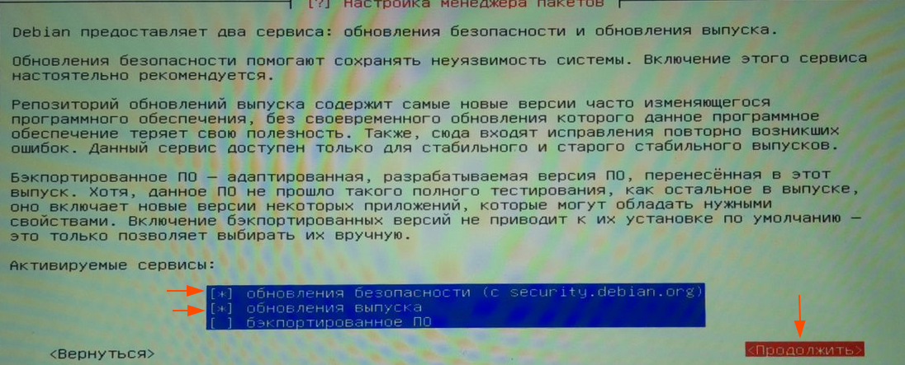
</p>

## 15. Этап «Выбор и установка программного обеспечения»

<p align="center">
  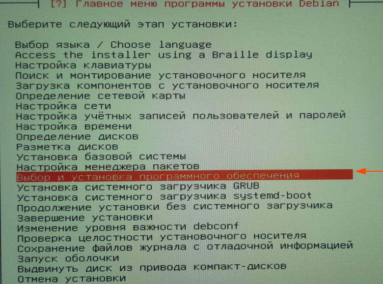
</p>

Я предпочитаю отключать автоматические обновления.

<p align="center">
  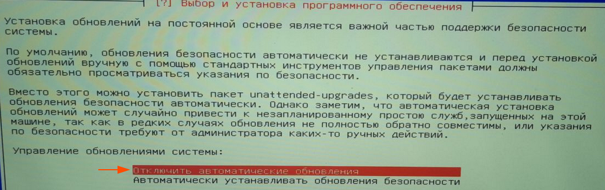
</p>

Отказываюсь участвовать в опросе.

<p align="center">
  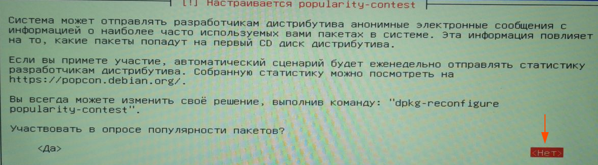
</p>

В качестве GUI я использую минималистичный XFCE. Этот классический дизайн мне привычен, тогда как, например, GNOME кажется контринтуитивным. Вы можете выбрать XFCE или любой другой вариант — графическая оболочка всегда остаётся делом вкуса.

<p align="center">
  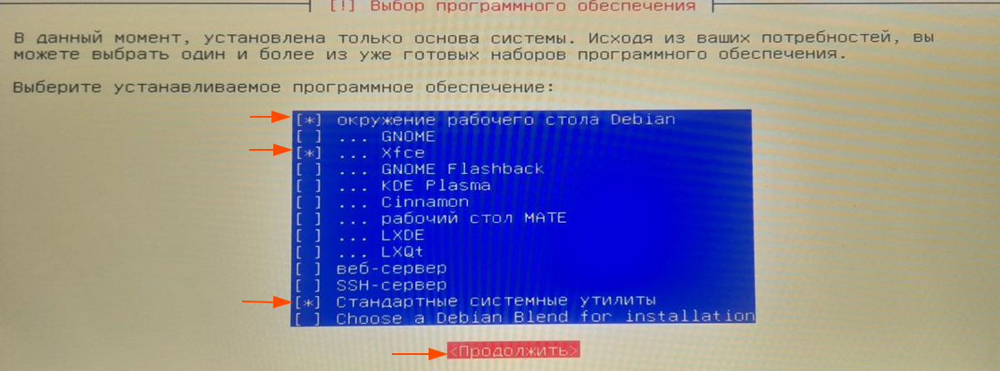
</p>

## 16. Этап «Установка системного загрузчика GRUB»

<p align="center">
  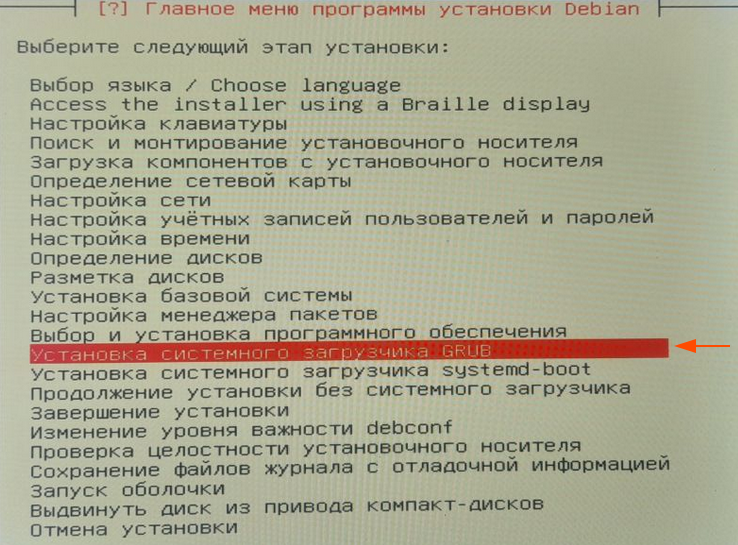
</p>

Следующее окно — это не ошибка, а предупреждение.

Установщик сообщает:
«У некоторых моделей EFI-прошивка работает нестабильно и не умеет загружать GRUB с жёсткого диска, как положено. Чтобы подстраховаться, можно положить копию GRUB в резервное место, откуда почти все EFI умеют стартовать».

Куда устанавливается дополнительный GRUB:

- обычный GRUB при EFI ставится в каталог EFI-раздела, например:
```bash
/boot/efi/EFI/debian/grubx64.efi
```
- дополнительная «резервная» копия ставится в стандартное место для съёмных носителей EFI:
```bash
/boot/efi/EFI/BOOT/BOOTX64.EFI
```

Это fallback-путь: любой UEFI, даже самый «капризный», обязан уметь загружать именно этот файл.

<p align="center">
  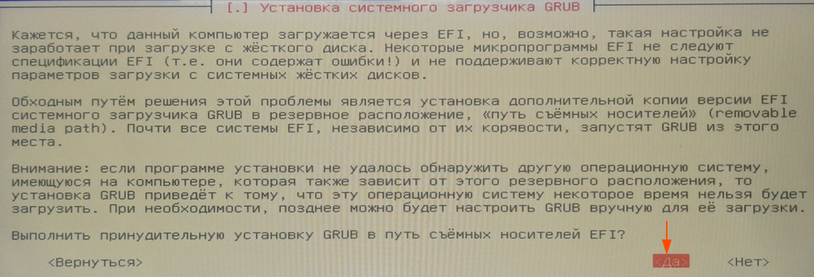
</p>

Для того, чтобы Debian загружался автоматически (без дополнительных манипуляций), при включении компьютера нужно выбрать - «да». 

<p align="center">
  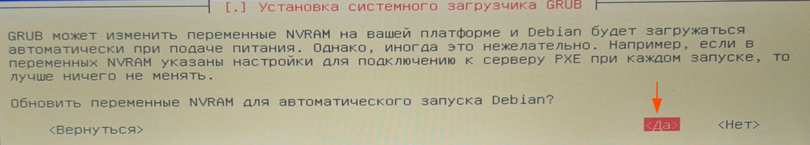
</p>

Так как я использую одну систему, то и не нуждаюсь в настройках для нескольких ОС. Выбираем - «нет».

<p align="center">
  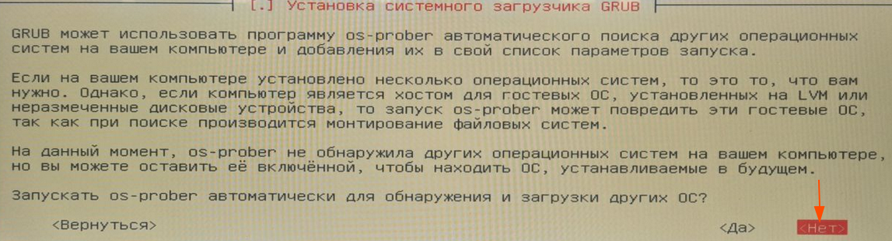
</p>

## 17. Этап «Завершение установки»

<p align="center">
  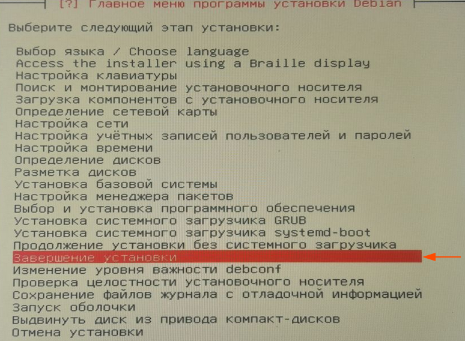
</p>

Оставляем значение по умолчанию - «да».

<p align="center">
  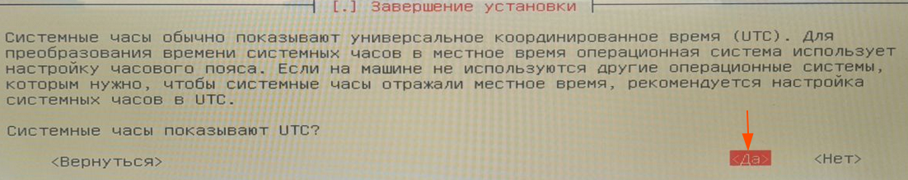
</p>

Извлекаем флешку и продолжаем. 

<p align="center">
  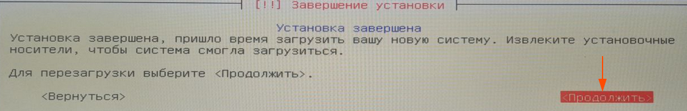
</p>

## Debian установлен!