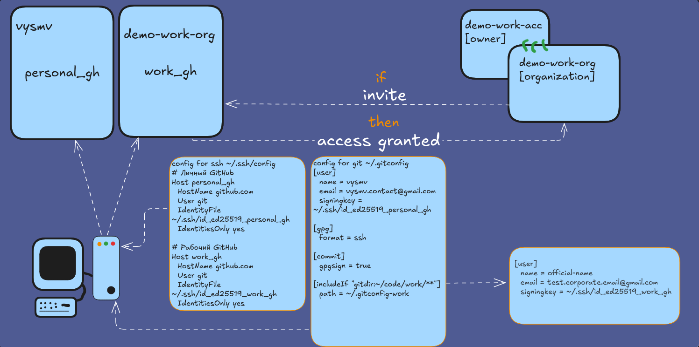

# Конфигурация Git и GitHub для работы с двумя аккаунтами

<p align="center">
  
</p>

## Шаг 1

```bash
mkdir -p ~/code/personal ~/code/work
```

## Шаг 2

```bash
ssh-keygen -t ed25519 -C "personal_gh" -f ~/.ssh/id_ed25519_personal_gh
ssh-keygen -t ed25519 -C "work_gh" -f ~/.ssh/id_ed25519_work_gh
```

## Шаг 3

Создаём конфиг ~/.ssh/config:

```bash
# Личный GitHub
Host personal_gh
  HostName github.com
  User git
  IdentityFile ~/.ssh/id_ed25519_personal_gh
  IdentitiesOnly yes

# Рабочий GitHub
Host work_gh
  HostName github.com
  User git
  IdentityFile ~/.ssh/id_ed25519_work_gh
  IdentitiesOnly yes
```

## Шаг 4

Вносим ключи в аккаунты GitHub:

```bash
[Личный аккаунт → Settings → SSH and GPG keys → New SSH key] [personal_gh]
[Рабочий аккаунт → Settings → SSH and GPG keys → New SSH key] [work_gh]
```

## Шаг 5

Создаём конфиг ~/.gitconfig:

```bash
[user]
  name = vysmv
  email = vysmv.contact@gmail.com
  signingkey = ~/.ssh/id_ed25519_personal_gh

[gpg]
  format = ssh

[commit]
  gpgsign = true

[includeIf "gitdir:~/code/work/**"]
  path = ~/.gitconfig-work
```

Создаём конфиг ~/.gitconfig-work:

```bash
[user]
  name = official-name
  email = test.corporate.email@gmail.com
  signingkey = ~/.ssh/id_ed25519_work_gh
```

## шаг 6
Тестируем

Сначала клонируем (находясь в директории ~/code/personal):

```bash
git clone git@personal_gh:vysmv/understand-and-do.git
```

Затем клонируем (находясь в директории ~/code/work):

```bash
git clone git@work_gh:demo-work-org/work-repo.git
```

## Шаг 7 
> **Важно!**
> 
> Если до того, как мы сгенерировали новые ключи и создали новые конфиги, у нас уже были старые проекты, которые работали со старыми адресами в remote, их нужно обновить.
> Заходим в один из старых проектов и вводим:

```bash
git remote -v
```
Если там указаны адреса типа:

```bash
origin  git@github.com:vysmv/notes-about-go.git (fetch)
origin  git@github.com:vysmv/notes-about-go.git (push)
```

то есть со старым хостом «github.com», нужно выполнить:

```bash
git remote set-url origin personal_gh:vysmv/notes-about-go.git
git remote set-url --push origin personal_gh:vysmv/notes-about-go.git
```

И тестируем:

```bash
git remote -v
ssh -T personal-gh
```

Первая команда покажет обновлённые хосты, а вторая поприветствует вас по имени пользователя.
